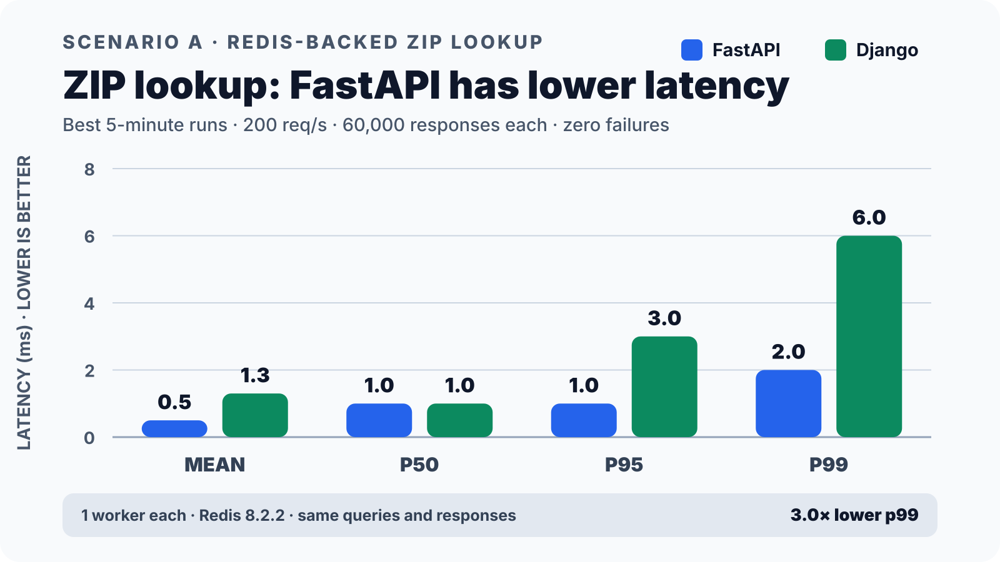
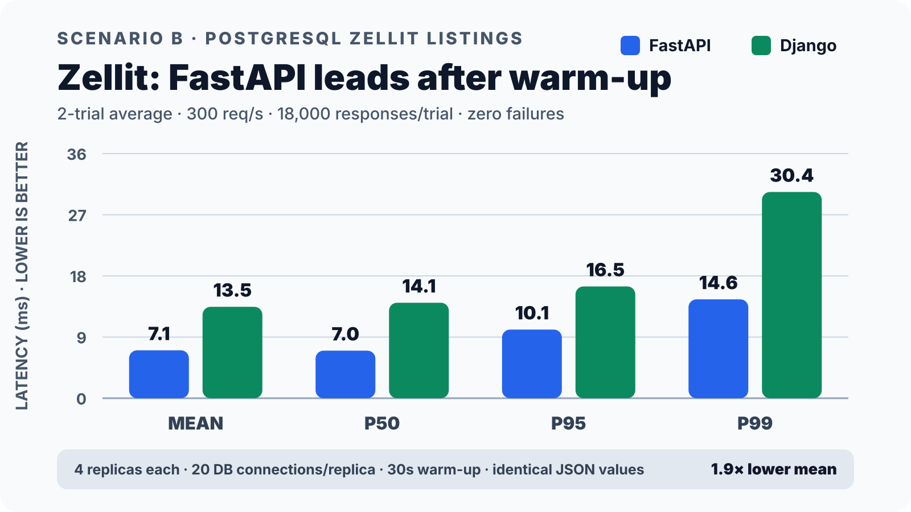

<div align="center">

# 🔋 Django vs. FastAPI ⚡

## **Batteries vs. Speed**

### A pragmatic DjangoCon 2026 conversation about framework trade-offs

**Calvin Hendryx-Parker** · **Frank Wiles**

[](https://sixfeetup.github.io/2026_DjangoCon_BatteriesVsSpeed/)
[](https://github.com/sixfeetup/2026_DjangoCon_BatteriesVsSpeed/actions/workflows/deploy-pages.yml)
[](https://django-ninja.dev/)
[](https://fastapi.tiangolo.com/)
[](LICENSE)

<br />

> ### 🥊 This is not a framework cage match.
> **There is no universally correct choice—only trade-offs that fit your application, workload, and team.**

[🎬 Talk preview](#talk-preview) · [🧪 Benchmarks](#benchmarks) · [🗺️ Repo map](#repository-map) · [🚀 Run the demos](#run-the-demos) · [🎨 Build the slides](#build-the-slides)

</div>

---

<a id="talk-preview"></a>

## 🎬 Talk preview

The syntax is almost the same. The decisions are not.

This talk compares **Django + Django Ninja** with **FastAPI** where the differences become meaningful: as a tiny endpoint grows into a product, meets real traffic, collects dependencies, and eventually has to be operated in production.

<table>
<tr>
<td width="33%" valign="top">
<h3>👥 Context first</h3>
<p>Team knowledge and product direction can matter more than a small framework-level speed difference.</p>
</td>
<td width="33%" valign="top">
<h3>🔋 Batteries</h3>
<p>Django offers integrated conventions and a deep reusable-app ecosystem. That leverage comes with maintenance choices.</p>
</td>
<td width="33%" valign="top">
<h3>⚡ Focus</h3>
<p>FastAPI provides API-oriented batteries, type-driven validation, and an async-first, composable foundation.</p>
</td>
</tr>
<tr>
<td width="33%" valign="top">
<h3>🌊 Async</h3>
<p><code>async def</code> is not magic. The complete request path—and the kind of waiting it does—determines whether async helps.</p>
</td>
<td width="33%" valign="top">
<h3>📊 Evidence</h3>
<p>Two equivalent implementations exercise Redis and PostgreSQL with deterministic data and shared Artillery workloads.</p>
</td>
<td width="33%" valign="top">
<h3>🚢 Operations</h3>
<p>Easy deployment paths may differ, but production systems converge around pooling, migrations, observability, and backups.</p>
</td>
</tr>
</table>

### 🔍 A few questions we explore

- 🧰 When do Django's admin, ORM, auth, permissions, and reusable apps create compounding value?
- 🪶 When is a focused, composable FastAPI service the better shape?
- 🤖 Has AI changed the **build vs. buy vs. vendor** dependency decision?
- 🌐 Which workloads actually benefit from async and higher concurrency?
- 📏 How do you design a benchmark that compares equivalent work?
- 🧩 When should one product use **both** frameworks?

> 💡 **The thesis:** value team knowledge, measure the workload you actually have, and make complexity earn its keep.

---

<a id="benchmarks"></a>

## 🧪 Two demos, one question

The repository includes paired implementations—not toy “hello world” endpoints—backed by shared deterministic datasets and benchmark contracts.

| | 📮 ZIP typeahead | 🏠 Zellit real-estate API |
|---|---|---|
| **Backing service** | Redis | PostgreSQL |
| **Workload** | Prefix search over 50,000 ZIP records | Demographics, listings, photos, comments, and votes |
| **Purpose** | Isolate framework + external I/O behavior | Exercise a realistic, database-backed read path |
| **Implementations** | Django Ninja + FastAPI | Django Ninja + FastAPI |
| **Shared contract** | Same records, validation, ordering, and response | Same generated data, five-query path, pagination, and response |

### 📈 A preview of the evidence

<table>
<tr>
<td width="50%" align="center">
<strong>📮 Redis ZIP workload</strong><br /><br />

</td>
<td width="50%" align="center">
<strong>🏠 PostgreSQL Zellit workload</strong><br /><br />

</td>
</tr>
</table>

> ⚠️ **All benchmarks are biased—including ours.** These charts describe these implementations, datasets, runtimes, machines, and load profiles. They are evidence about a workload, not a universal framework ranking.

The committed chart source records run IDs, versions, request counts, latency distributions, errors, runtime shapes, and selection rules in [`benchmark-chart-data.json`](slides/public/images/benchmark-chart-data.json). Standalone benchmark reports are available under [`research/reports/`](research/reports/).

---

## 🧭 A decision compass

| Lean toward **Django + Ninja** 🔋 | Lean toward **FastAPI** ⚡ |
|---|---|
| Your team already knows and operates Django | The service is intentionally focused and API-only |
| You are adding an API to an existing Django product | Concurrent I/O is central to the workload |
| Admin, auth, permissions, or workflows matter | You want to compose the data and application stack |
| Product scope is likely to expand | A smaller full-stack surface is a meaningful goal |
| Reusable Django apps save substantial product work | FastAPI's tooling removes material friction |

<div align="center">

### 🧩 A third option: use both

**Django for product workflows** + **FastAPI for a specialized service** can be a strong architecture—when the extra operational complexity is justified.

</div>

---

<a id="repository-map"></a>

## 🗺️ Repository map

```text
.
├── slides/                         🎨 Slidev deck, theme, charts, and tests
├── research/
│   ├── demo/
│   │   ├── django/{zip,zellit}/    🔋 Django Ninja implementations
│   │   ├── fastapi/{zip,zellit}/   ⚡ FastAPI implementations
│   │   └── shared/{zip,zellit}/    🧪 Data generators + Artillery harnesses
│   └── reports/                    📊 Portable benchmark reports
└── docs/
    ├── rough-talk-outline.md       📝 Detailed talk outline
    └── NOTES.md                    💭 Presentation planning notes
```

### 🔗 Useful starting points

- 🖥️ [`slides/slides.md`](slides/slides.md) — complete presentation and speaker notes
- 📮 [Django ZIP](research/demo/django/zip/README.md) · [FastAPI ZIP](research/demo/fastapi/zip/README.md)
- 🏠 [Django Zellit](research/demo/django/zellit/README.md) · [FastAPI Zellit](research/demo/fastapi/zellit/README.md)
- 🧬 [Shared Zellit data + benchmark design](research/demo/shared/zellit/README.md)
- 📐 [`docs/rough-talk-outline.md`](docs/rough-talk-outline.md) — thesis, flow, methodology, and decision guide

---

<a id="run-the-demos"></a>

# 🚀 Run the demos

## 1️⃣ Prerequisites

You will need:

- 🐳 **Docker** with Docker Compose
- 🐍 **Python 3** and [`uv`](https://docs.astral.sh/uv/) for host-side tests/data tools
- 🟢 [`nvm`](https://github.com/nvm-sh/nvm), **Corepack**, and the Node version pinned in [`.nvmrc`](.nvmrc) for Artillery
- 🌐 `curl`, Git, and enough free disk space

```bash
git clone https://github.com/sixfeetup/2026_DjangoCon_BatteriesVsSpeed.git
cd 2026_DjangoCon_BatteriesVsSpeed

# Select the repository's pinned Node.js version when using benchmarks/slides.
source "${NVM_DIR:-$HOME/.nvm}/nvm.sh"
nvm use
corepack enable
```

> 🐘 **Heads up:** Zellit generates and loads roughly **2.2 million PostgreSQL rows**. Its first run takes longer and needs substantially more disk space than the Redis ZIP demo.

## 2️⃣ Try the fast smoke tests

Each command builds its stack, starts its dependencies, calls the public API, validates the response, and cleans up. Run them one at a time so their default ports do not collide.

### 📮 Redis ZIP typeahead

```bash
# FastAPI
cd research/demo/fastapi/zip
./scripts/smoke.sh

# Django Ninja — checks both gevent and sync runtimes
cd ../../django/zip
CLEANUP=1 ./scripts/smoke.sh
```

The endpoint exercised is:

```http
GET /zip-codes?q=462
```

### 🏠 PostgreSQL Zellit

```bash
# From the repository root: FastAPI
cd research/demo/fastapi/zellit
API_PORT=8001 ./scripts/smoke.sh

# Django Ninja — generates a clean dataset and checks two runtimes
cd ../../django/zellit
CLEAN_START=1 CLEANUP=1 ./scripts/smoke.sh
```

The measured endpoint is:

```http
GET /api/v1/zip-codes/46201/listings?limit=20&offset=0
```

<details>
<summary><strong>🔥 Run the shared Artillery benchmark harnesses</strong></summary>

### ZIP workload

```bash
# Install and test the shared harness.
cd research/demo/shared/zip/benchmark
corepack pnpm install --frozen-lockfile
corepack pnpm test

# FastAPI smoke profile
RUN_ID=fastapi-zip-local-smoke CLEANUP=1 ./scripts/run-compose.sh smoke

# Django gevent smoke profile
cd ../../../django/zip
RUN_ID=django-zip-local-smoke CLEANUP=1 \
  ./scripts/run-compose.sh smoke gevent-1
```

### Zellit workload

```bash
cd research/demo/shared/zellit/benchmark
corepack pnpm install --frozen-lockfile
corepack pnpm test

# Same corpus and profile, isolated framework stacks
RUN_ID=fastapi-zellit-local-smoke CLEANUP=1 \
  ./scripts/run-fastapi-compose.sh smoke
RUN_ID=django-zellit-local-smoke CLEANUP=1 \
  ./scripts/run-compose.sh smoke gevent-1
```

Profiles include `smoke`, `baseline`, `staircase`, and `sustained`. `overload` is intentionally opt-in. Every run writes reproducibility metadata and raw output beneath the corresponding `benchmark/results/<run-id>/` directory.

> 🧯 Smoke profiles prove correctness and wiring only. Do not make performance claims from smoke output. Use repeated, alternating runs with identical profiles for a comparison.

</details>

For Python tests, custom runtimes, dataset verification, benchmark profile semantics, and teardown options, follow each demo's linked README in the [repository map](#repository-map).

---

<a id="build-the-slides"></a>

# 🎨 Build the slides

The presentation uses [Slidev](https://sli.dev/) and is deployed to GitHub Pages by [`.github/workflows/deploy-pages.yml`](.github/workflows/deploy-pages.yml).

## 1️⃣ Install the pinned toolchain

```bash
cd "$(git rev-parse --show-toplevel)"
source "${NVM_DIR:-$HOME/.nvm}/nvm.sh"
nvm use
corepack enable

cd slides
corepack pnpm install --frozen-lockfile
```

## 2️⃣ Preview while editing

```bash
corepack pnpm dev
```

Slidev opens the deck at <http://localhost:3030>. Edit [`slides/slides.md`](slides/slides.md) and the browser updates live. ✨

## 3️⃣ Test and build for production

```bash
corepack pnpm test
corepack pnpm build
```

The static site is written to `slides/dist/`.

<details>
<summary><strong>🛠️ Extra slide commands</strong></summary>

```bash
# Regenerate benchmark SVGs from committed chart data
corepack pnpm charts

# Export the deck (Playwright/Chromium is included in the slide workspace)
corepack pnpm export

# Build with the GitHub Pages repository base path
corepack pnpm build --base /2026_DjangoCon_BatteriesVsSpeed/
```

</details>

---

<div align="center">

## 🔋 Batteries? ⚡ Speed?

### Choose constraints—not hype.

Made for thoughtful framework conversations at **DjangoCon 2026**. 🐍💛

</div>
