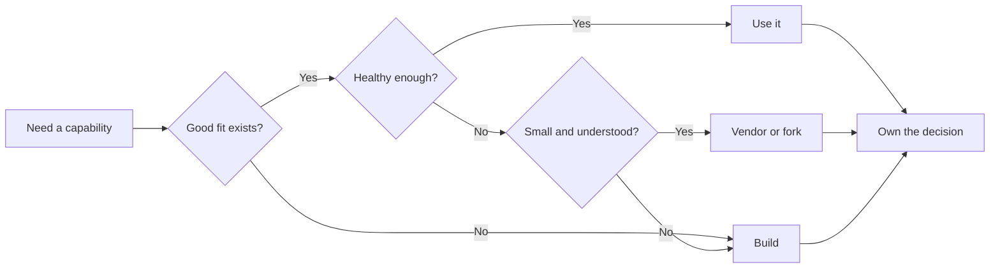
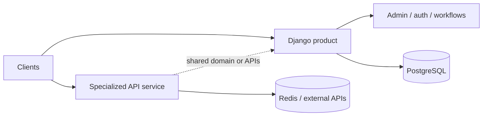
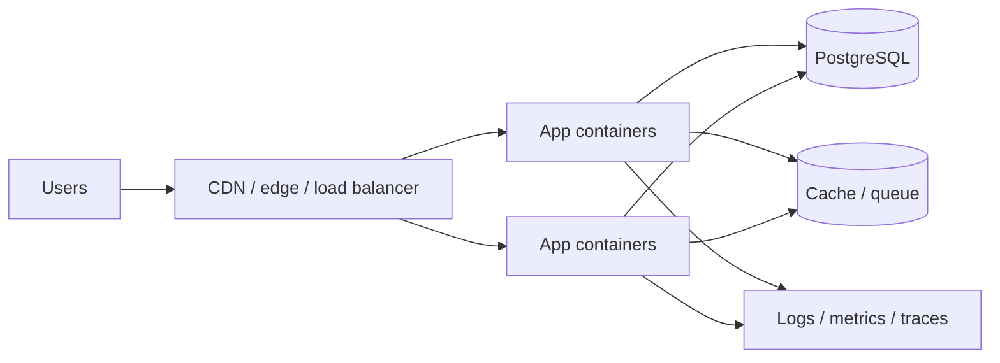

# Django vs. FastAPI

## Batteries vs. Speed

<div class="mt-8 text-2xl">
  Calvin Hendryx-Parker &nbsp;·&nbsp; Frank Wiles
</div>

<div class="mt-12 text-lg opacity-80">
  Slides, examples, and eventually reproducible benchmarks
</div>

<div class="mt-2 font-mono text-sm">
  github.com/sixfeetup/2026_DjangoCon_BatteriesVsSpeed
</div>

<!--
DRAFT: Add a large QR code for the repository.

Keep this slide visible through both introductions so the audience has time to scan it.
Confirm the exact public URL and deployed slide URL before the talk.

Timing: 0:00–2:00
-->

---
layout: center
class: text-center
---

# There is no wrong answer here.

<div v-click class="mt-10 text-2xl opacity-80">
There are only trade-offs that fit your context—or do not.
</div>

<!--
Set the tone immediately: this is not a framework cage match.
Both projects are healthy choices. We are comparing constraints, not declaring a universal winner.

Timing: 2:00–3:00
-->

---
layout: two-cols
layoutClass: gap-12
---

# Two perspectives

<div class="mt-8 text-2xl font-bold">Calvin Hendryx-Parker</div>

- FastAPI practitioner
- Agency and operations perspective
- Built and deployed a real FastAPI side project
- Here to defend speed—and question the hype

::right::

<div class="mt-21 text-2xl font-bold">Frank Wiles</div>

- Long-time Django practitioner
- Deep ecosystem and scaling experience
- Uses Django where the boring parts matter
- Here to defend batteries—and question their cost

<!--
DRAFT: Frank and Calvin should replace these bullets with the bios they want spoken.
Avoid reading biographies. Establish why each person has useful experience with the trade-offs.

Timing: 3:00–4:00
-->

---
layout: center
class: text-center
---

# What are we actually comparing?

<div class="mt-10 text-4xl">
  Django <span class="opacity-50">+</span> Django Ninja
  <span class="mx-5 opacity-50">vs.</span>
  FastAPI
</div>

<div v-click class="mt-12 text-xl opacity-75">
DRF still matters—but it is not the only Django API story.
</div>

<!--
Say this explicitly so the audience does not feel that the title promised bare Django vs. FastAPI and the talk quietly substituted Ninja.

Ninja is itself an example of Django's battery ecosystem. DRF can appear in the feature discussion where useful, but the code and benchmark comparison should be Ninja vs. FastAPI.

Timing: 4:00–5:30
-->

---

# Start with context, not framework

<div class="grid grid-cols-3 gap-5 mt-10">
  <div class="rounded-xl border border-main p-5">
    <div class="text-3xl mb-3">👥</div>
    <div class="text-xl font-bold">Your team</div>
    <div class="mt-3 opacity-75">What do they know, operate, and debug well?</div>
  </div>
  <div class="rounded-xl border border-main p-5">
    <div class="text-3xl mb-3">🧭</div>
    <div class="text-xl font-bold">Your scope</div>
    <div class="mt-3 opacity-75">A bounded API—or the beginning of a product?</div>
  </div>
  <div class="rounded-xl border border-main p-5">
    <div class="text-3xl mb-3">📈</div>
    <div class="text-xl font-bold">Your workload</div>
    <div class="mt-3 opacity-75">Where is the real bottleneck?</div>
  </div>
</div>

<div v-click class="mt-10 text-2xl text-center">
Framework choice is an organizational decision, too.
</div>

<!--
Examples from the transcript:
- A focused internal service with three endpoints and bounded scope may be a natural FastAPI project.
- An existing Django system with dozens of models may not become simpler merely by putting FastAPI in front of it.
- A Django-expert team should demand a material reason before introducing a second stack.

Timing: 5:30–7:00
-->

---
layout: center
class: text-center
---

# Did the slide change?

<div class="mt-12 text-2xl opacity-75">
A minimal API in FastAPI…
</div>

<!--
Set up the code-comparison bit. Frank can prompt Calvin to show the FastAPI version.

Timing: 7:00–7:15
-->

---

# FastAPI

```python {1-2|4|7-10|12-14|all}
from fastapi import FastAPI
from pydantic import BaseModel

app = FastAPI()


class Item(BaseModel):
    name: str
    price: float
    is_offer: bool | None = None


@app.put("/items/{item_id}")
def update_item(item_id: int, item: Item):
    return {"item_name": item.name, "item_id": item_id}
```

<!--
Walk only the shape: imports, app, schema, decorated operation.
Do not teach FastAPI syntax—the audience can inspect the repository.
-->

---

# Django Ninja

```python {1|3|6-9|11-13|all}
from ninja import NinjaAPI, Schema

api = NinjaAPI()


class Item(Schema):
    name: str
    price: float
    is_offer: bool | None = None


@api.put("/items/{item_id}")
def update_item(request, item_id: int, item: Item):
    return {"item_name": item.name, "item_id": item_id}
```

<div v-click class="absolute right-16 bottom-10 text-2xl rotate--3">
Wait… did it change?
</div>

<!--
Use the transcript's planned joke: one presenter claims the slide did not move.
Then highlight the actual differences: imports, app/API naming, Schema/BaseModel, and Ninja's request argument.

DRAFT: Verify both examples against the exact dependency versions used in the demos.

Timing through this slide: 9:30
-->

---
layout: center
class: text-center
---

# Syntax is not the decision.

<div class="mt-10 text-3xl opacity-80">
The interesting differences emerge as the application grows.
</div>

<!--
Transition from code to batteries and ecosystem.
Both provide type-driven schemas, validation, routing, and generated API documentation. The meaningful divergence is architecture and what can be added later.

Timing: 9:30–10:00
-->

---

# Different batteries. Different opinions.

| Concern | Django + Ninja | FastAPI |
|---|---|---|
| Validation & OpenAPI | Ninja | Built in |
| Data layer | Django ORM convention | Choose your own |
| Admin | Django admin | Choose/build an option |
| Auth & permissions | Django ecosystem | API-oriented tools + choices |
| WebSockets | ASGI/Channels or a service | Starlette/FastAPI support |
| Reusable app ecosystem | Deep, convention-driven | Younger, more composable |

<div class="mt-6 text-sm opacity-60">
Working comparison for discussion—not a scorecard.
</div>

<!--
DRAFT / FACT CHECK: Verify every row and decide whether DRF deserves a third column.
Potential matrix rows for appendix or repo: templates, background jobs, testing, migrations, ORM async behavior, docs customization, deployment.

The key argument is not that FastAPI has no batteries. It has batteries selected for its API flow. Django's shared ORM and application conventions make deeper reusable applications possible.

Timing: 10:00–12:00
-->

---
layout: two-cols
layoutClass: gap-12
---

# A battery that buys leverage

## Django Activity Stream

```python
from actstream import action

action.send(
    request.user,
    verb="commented on",
    action_object=comment,
    target=listing,
)
```

::right::

<div class="mt-12 text-xl">

A small integration can provide:

- actors, verbs, objects, and targets
- activity feeds
- reusable queries and relationships
- conventions already tied to Django models

</div>

<div v-click class="mt-8 text-2xl font-bold">
You could build it. But should you?
</div>

<!--
Use this as the concrete "batteries" story.
The package does not make the feature free, but it lets a mature design and Django's conventions do substantial work.

DRAFT: Verify API example and current package status. Add a screenshot from a real project if permission allows.
Source: https://django-activity-stream.readthedocs.io/

Timing: 12:00–14:00
-->

---
layout: center
class: text-center
---

# Batteries have a shelf life.

<div class="mt-10 flex justify-center items-center gap-5 text-2xl">
  <div class="rounded-xl border border-main px-6 py-4">django-fsm</div>
  <div class="text-3xl opacity-50">→</div>
  <div class="rounded-xl border border-main px-6 py-4">maintenance slows</div>
  <div class="text-3xl opacity-50">→</div>
  <div class="rounded-xl border border-main px-6 py-4">django-fsm-2</div>
</div>

<div class="grid grid-cols-2 gap-10 mt-12 text-left">
  <div>
    <div class="text-xl font-bold text-green-500">What you bought</div>
    <div class="mt-2 opacity-80">A mature design, saved time, and community experience.</div>
  </div>
  <div>
    <div class="text-xl font-bold text-amber-500">What you still own</div>
    <div class="mt-2 opacity-80">Compatibility, upgrades, security, and a contingency plan.</div>
  </div>
</div>

<!--
Tell the nuanced dependency story: maintainers move on, forks happen, communities can recover projects.
Options are wait, contribute, fork, replace, or vendor.

DRAFT: Verify the current history and status before presenting this lifecycle as fact.

Timing: 14:00–16:00
-->

---

# Build, buy, or vendor?



<div v-click class="mt-4 text-center text-xl">
AI can lower implementation cost. It does not erase ownership.
</div>

<!--
Podcast-style exchange:
- AI makes it easier to understand nine files, patch for a new Django version, or build a tailored feature.
- But generated or vendored code still needs tests, security review, maintenance, and operational understanding.
- Avoid drifting into a 20-minute AI discussion; timebox this tightly.

Timing: 16:00–18:00
-->

---
layout: center
class: text-center
---

# Async?

<div v-click class="mt-14 text-5xl font-bold">
Do you actually need it?
</div>

<!--
Keep this visually spare so the audience listens to the conversation.

Timing: 18:00–18:30
-->

---

# Async is a workload property

<div class="grid grid-cols-2 gap-10 mt-8">
  <div class="rounded-xl border border-green-500/50 p-6">
    <div class="text-2xl font-bold text-green-500">Often valuable</div>
    <ul class="mt-5 text-xl leading-9">
      <li>Many concurrent I/O waits</li>
      <li>Parallel service aggregation</li>
      <li>WebSockets and long-lived connections</li>
      <li>A known high-concurrency hot path</li>
    </ul>
  </div>
  <div class="rounded-xl border border-amber-500/50 p-6">
    <div class="text-2xl font-bold text-amber-500">Not magic</div>
    <ul class="mt-5 text-xl leading-9">
      <li>CPU-bound work</li>
      <li>Mostly synchronous dependencies</li>
      <li>Database-bound requests</li>
      <li>“It sounds faster”</li>
    </ul>
  </div>
</div>

<div v-click class="mt-8 text-center text-2xl">
The whole request path matters—not just <code>async def</code>.
</div>

<!--
Most applications do not benefit merely because everything is declared async.
Discuss complexity: debugging, blocking libraries, ORM boundaries, and operational behavior.

DRAFT / FACT CHECK: Cite and accurately describe current Django async request and ORM capabilities. Avoid broad statements that either framework is "fully async."

Timing: 18:30–21:00
-->

---
layout: center
class: text-center
---

# Maybe only one part is special.



<div class="mt-5 text-xl opacity-80">
A monolith plus one focused service can be a feature—not a failure.
</div>

<!--
Use the transcript's examples: a timeline, chat/WebSocket system, or endpoint wrapping many internal APIs may deserve separate treatment. Password settings and admin workflows may not.

Do not prescribe this architecture universally. It introduces a second service and its own operational cost.

Timing: 21:00–22:00
-->

---
layout: center
class: text-center
---

# ⚠️ All benchmarks are biased.

<div class="mt-10 text-3xl opacity-80">
Including ours.
</div>

<div v-click class="mt-12 text-xl">
A benchmark measures a workload, an implementation, and an environment.
<br>It does not measure your application.
</div>

<!--
This line was central to the planning conversation. Establish humility before showing any chart.

Timing: 22:00–22:45
-->

---

# Our benchmark contract

<div class="grid grid-cols-2 gap-x-12 gap-y-4 mt-6 text-xl">
  <div v-click>✓ Equivalent behavior and validation</div>
  <div v-click>✓ Identical data and query shape</div>
  <div v-click>✓ Pinned versions and server config</div>
  <div v-click>✓ Warm-up + repeated measured runs</div>
  <div v-click>✓ Multiple concurrency levels</div>
  <div v-click>✓ Raw results in the repository</div>
</div>

<div v-click class="mt-12 text-center text-2xl font-bold">
Throughput + latency + errors + resources
</div>

<div class="mt-3 text-center opacity-70">
Not one heroic requests-per-second number.
</div>

<!--
DRAFT: This is a promise. Do not retain any bullet the final benchmark process does not satisfy.

Proposed tooling: Docker Compose and Artillery. Record CPU, memory, worker counts, pool settings, hardware, duration, seed, and dependency versions. Report p50/p95/p99, throughput, and errors.

Timing: 22:45–24:00
-->

---
layout: two-cols
layoutClass: gap-14
---

# Scenario A: ZIP typeahead

<div class="mt-6 text-6xl">📮 → ⚡</div>

```http
GET /zip-codes?q=462
```

```json
[
  { "zip": "46201", "city": "Indianapolis" },
  { "zip": "46202", "city": "Indianapolis" }
]
```

::right::

<div class="mt-16 text-xl leading-9">

- Redis-backed lookup
- Real external I/O, no ORM
- Same response and validation
- Lower and higher concurrency
- Isolate framework + I/O behavior

</div>

<!--
Working concurrency idea from the transcript: roughly 20 vs. 200 concurrent connections. Choose exact stages only after trial runs and document what "20" and "200" mean in Artillery.

DRAFT: Build both implementations and define the deterministic ZIP dataset.

Timing: 24:00–25:30
-->

---
layout: two-cols
layoutClass: gap-12
---

# Scenario B: Zellit

## Zillow meets Reddit

<div class="mt-5 text-6xl">🏠 💬 ⬆️</div>

<div class="mt-8 text-xl opacity-80">
Synthetic real estate listings with opinions.
</div>

::right::

<div class="mt-8 text-xl leading-9">

- PostgreSQL reads
- ZIP-code demographics
- Homes joined to photos
- Optional votes and comments
- Deterministic generated data
- Realistic connection management

</div>

<div class="mt-8 rounded-lg bg-amber-500/15 border border-amber-500/40 p-3 text-center">
Name still needs Frank's vote: <strong>Zellit?</strong> <strong>Zealot?</strong>
</div>

<!--
The transcript brainstormed a Zillow/Reddit cross and landed on a name phonetically, but not a stable spelling.

Decide whether votes/comments are part of the measured endpoint or just visual flavor. Keep the measured query understandable: demographics plus homes and photos is enough.

DRAFT: Define schema, indexes, row counts, pool settings, seeds, and exact response shape before implementation.

Timing: 25:30–27:00
-->

---

# Results: Redis workload

<div class="mt-8 h-62 rounded-xl border-2 border-dashed border-main flex items-center justify-center">
  <div class="text-center">
    <div class="text-4xl opacity-50">CHART PLACEHOLDER</div>
    <div class="mt-4 text-xl opacity-60">p50 · p95 · p99 · throughput · errors</div>
    <div class="mt-2 opacity-50">lower and higher concurrency</div>
  </div>
</div>

<div class="mt-6 text-center text-xl">
Describe what happened—not what we expected to happen.
</div>

<!--
Do not invent results. Replace with a chart generated from committed benchmark artifacts.
Include run ID and environment in a readable footer.

Discuss variance and surprises. If results are effectively tied, that is a useful result.

Timing: 27:00–29:00
-->

---

# Results: PostgreSQL workload

<div class="mt-8 h-62 rounded-xl border-2 border-dashed border-main flex items-center justify-center">
  <div class="text-center">
    <div class="text-4xl opacity-50">CHART PLACEHOLDER</div>
    <div class="mt-4 text-xl opacity-60">p50 · p95 · p99 · throughput · errors</div>
    <div class="mt-2 opacity-50">same data, queries, and response</div>
  </div>
</div>

<div class="mt-6 text-center text-xl">
When the database dominates, how much framework is left to measure?
</div>

<!--
Do not invent results. Replace with a chart generated from committed benchmark artifacts.
Discuss connection pools and server worker configuration explicitly.

Timing: 29:00–31:00
-->

---
layout: center
class: text-center
---

# Faster is not the same as better.

<div class="grid grid-cols-3 gap-6 mt-12 text-xl">
  <div class="rounded-xl border border-main p-5">Does the difference survive a realistic workload?</div>
  <div class="rounded-xl border border-main p-5">Does it matter at your traffic level?</div>
  <div class="rounded-xl border border-main p-5">What do you give up to get it?</div>
</div>

<div v-click class="mt-12 text-2xl font-bold">
Measure the bottleneck you actually have.
</div>

<!--
Possible discussion: FastAPI may provide more concurrency headroom out of the box in some workloads, but a modest difference may not outweigh Django's ecosystem and team familiarity.

Do not mention a percentage until the benchmark is complete. Validate any Django Bolt or gevent comparison separately; likely move those to appendix or omit unless they materially explain a result.

Timing: 31:00–32:00
-->

---

# Easy deploy paths

<div class="grid grid-cols-2 gap-10 mt-10">
  <div class="rounded-xl border border-main p-6">
    <div class="text-2xl font-bold">FastAPI Cloud</div>
    <div class="mt-7 font-mono text-xl rounded bg-black/20 p-4">fastapi deploy</div>
    <div class="mt-6 opacity-75">A framework-aligned happy path.</div>
  </div>
  <div class="rounded-xl border border-main p-6">
    <div class="text-2xl font-bold">Django Simple Deploy</div>
    <div class="mt-7 font-mono text-xl rounded bg-black/20 p-4">python manage.py simple_deploy</div>
    <div class="mt-6 opacity-75">A Django path across supported platforms.</div>
  </div>
</div>

<div v-click class="mt-8 text-center text-xl">
Compare capabilities—not command length alone.
</div>

<!--
Calvin: show the compelling one-command FastAPI Cloud experience from the calendar app.
Frank: respond with the current Django Simple Deploy story and established platform paths.

DRAFT / FACT CHECK: Verify exact commands, supported platforms, limitations, pricing, and database assumptions immediately before the conference.
The calendar app also uses Neon and Cloudflare infrastructure; do not imply the entire production system is one command.

Timing: 32:00–35:00
-->

---

# In production, the shapes converge



<div class="mt-3 text-center text-xl opacity-80">
Containers, migrations, pooling, secrets, observability, backups, incidents…
</div>

<!--
At Kubernetes/production scale, replacing the app label from Django to FastAPI does not remove the surrounding operational system.
Use the SCAFF full-stack architecture diagram instead if it is clearer and permission is confirmed.

Timing: 35:00–37:00
-->

---
layout: two-cols
layoutClass: gap-12
---

# Lean toward Django + Ninja when…

<div class="mt-8 text-xl leading-10">

- The team already knows Django
- An existing Django product needs an API
- Admin, auth, permissions, or workflows matter
- Scope is likely to grow beyond “just an API”
- Reusable apps create meaningful leverage
- A small speed difference would not change the business

</div>

::right::

<div class="mt-20 text-7xl text-center">🔋</div>

<div class="mt-8 text-center text-2xl font-bold">
Optimize for total product work.
</div>

<!--
This is a heuristic, not a checklist that mechanically produces an answer.

Timing: 37:00–38:30
-->

---
layout: two-cols
layoutClass: gap-12
---

# Lean toward FastAPI when…

<div class="mt-8 text-xl leading-10">

- The service is focused and API-only
- Scope is intentionally bounded
- Concurrent I/O is central to the workload
- The team wants a composable stack
- Unused full-stack surface area is a real concern
- Its tooling or deploy path removes material friction

</div>

::right::

<div class="mt-20 text-7xl text-center">⚡</div>

<div class="mt-8 text-center text-2xl font-bold">
Optimize for the service you actually need.
</div>

<!--
Mention legitimate concerns separately from trivia. A few megabytes in a container is rarely decisive; unnecessary complexity, middleware, or security surface can be.

Timing: 38:30–40:00
-->

---
layout: center
class: text-center
---

# You can use both.

<div class="mt-10 text-3xl">
  Django for the product
  <span class="mx-4 opacity-50">+</span>
  FastAPI for a specialized service
</div>

<div class="mt-10 text-xl opacity-80">
Or Django + Ninja everywhere. Or FastAPI everywhere.
</div>

<div v-click class="mt-10 text-2xl font-bold">
Complexity must earn its keep.
</div>

<!--
Mix-and-match is an option, not the automatic compromise.
A second framework adds deployment, observability, authentication, data ownership, and staffing complexity. Extract a service only when its constraints justify that cost.

Timing: 40:00–41:00
-->

---
layout: center
class: text-center
---

# Our answer

<div class="mt-10 grid grid-cols-2 gap-8 text-2xl">
  <div v-click class="rounded-xl border border-main p-5">Value team knowledge.</div>
  <div v-click class="rounded-xl border border-main p-5">Measure your workload.</div>
  <div v-click class="rounded-xl border border-main p-5">Buy batteries for leverage.</div>
  <div v-click class="rounded-xl border border-main p-5">Build when ownership is worth it.</div>
</div>

<div v-click class="mt-10 text-3xl font-bold">
Choose constraints—not hype.
</div>

<!--
Restate the opening: there is no wrong answer independent of context.
Both communities are active and neither framework is going away. Verify and cite project-health claims in the final deck/repository.

Timing: 41:00–43:00
-->

---
layout: center
class: text-center
---

# Thank you

<div class="mt-8 text-2xl">
Questions, code, methodology, raw results, and references
</div>

<div class="mt-10 font-mono text-lg">
  github.com/sixfeetup/2026_DjangoCon_BatteriesVsSpeed
</div>

<div class="mt-12 text-xl opacity-80">
Calvin Hendryx-Parker &nbsp;·&nbsp; Frank Wiles
</div>

<!--
DRAFT: Add the final QR code, contact details, and deployed slide URL.
Leave approximately two minutes for the close/transition or questions depending on conference format.

Timing: 43:00–45:00
-->
